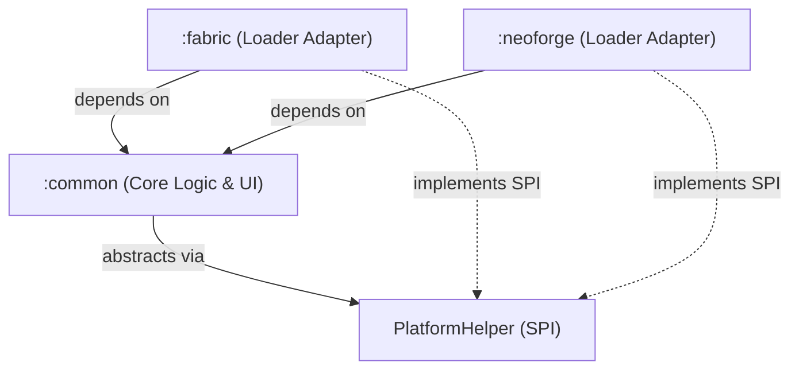
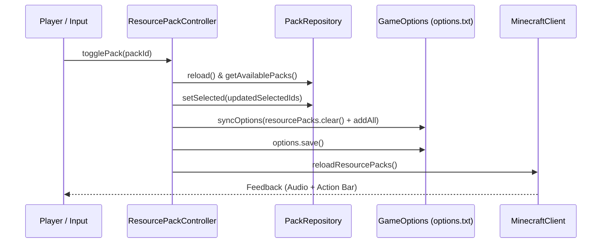

# System Architecture — MC-AutomaticPackage

This document details the architectural design, topological organization, and operational mechanisms of **MC-AutomaticPackage**.

---

## 1. Topological Structure

The project follows a **Non-Monolithic** (multi-module) topology using Gradle:

```
mc-automatic-package/
│
├── common/                  ← Core domain logic, UI, and config (100% Loader-Agnostic)
│   ├── src/main/java/
│   │   └── com/sxnnyside/autopack/
│   │       ├── AutomaticPackageCommon.java
│   │       ├── command/AutoPackCommand.java
│   │       ├── config/ModConfig.java
│   │       ├── gui/PackSelectorScreen.java & PackListWidget.java
│   │       ├── pack/ResourcePackController.java & PackInfo.java
│   │       └── platform/PlatformHelper.java & Services.java
│   └── src/main/resources/assets/automaticpackage/lang/
│
├── fabric/                  ← Fabric Loader adapter & Fabric API integration
│   ├── src/main/java/
│   │   └── com/sxnnyside/autopack/fabric/
│   │       ├── AutomaticPackageFabric.java
│   │       └── FabricPlatformHelper.java
│   └── src/main/resources/
│       ├── fabric.mod.json
│       └── META-INF/services/...PlatformHelper
│
└── neoforge/                ← NeoForge Loader adapter & Event Bus integration
    ├── src/main/java/
    │   └── com/sxnnyside/autopack/neoforge/
    │       ├── AutomaticPackageNeoForge.java
    │       ├── NeoForgeClientEvents.java
    │       └── NeoForgePlatformHelper.java
    └── src/main/resources/
        ├── META-INF/neoforge.mods.toml
        └── META-INF/services/...PlatformHelper
```

---

## 2. Dependency Graph & Isolation Rule



### Strict Isolation Rule
- The `:common` module **must never** import classes from `net.fabricmc.*` or `net.neoforged.*`.
- All Minecraft client interactions in `:common` rely strictly on official Mojang mappings (`loom.officialMojangMappings()`), ensuring zero mapping friction when compiling Fabric and NeoForge JARs.

---

## 3. Platform Abstraction Layer (SPI)

Platform-specific operations are abstracted behind the `PlatformHelper` interface:

```java
public interface PlatformHelper {
    Path getConfigDirectory();
    String getPlatformName();
    boolean isModLoaded(String modId);
}
```

Implementations are discovered at runtime using Java's standard `ServiceLoader` via `Services.PLATFORM`:
- **Fabric:** Uses `FabricLoader.getInstance().getConfigDir()`.
- **NeoForge:** Uses `FMLPaths.CONFIGDIR.get()`.
- **Unit Testing:** Uses a mock path in `build/test-config`.

---

## 4. Resource Pack Lifecycle & State Management

Manipulating resource packs programmatically in Minecraft requires synchronized persistence across three layers:



### Options Sync Fix
To ensure user-selected resource packs survive client restarts without breaking game core packs:
1. `pack.isRequired()` is checked to filter out non-removable vanilla or server packs.
2. Only user-controllable pack IDs are stored in `client.options.resourcePacks`.
3. `client.options.save()` is called synchronously before triggering `client.reloadResourcePacks()`.

---

## 5. In-Game GUI Architecture

The in-game user interface is implemented in `:common`:

- **`PackSelectorScreen`** (`extends Screen`):
  - Top search bar (`EditBox`) with live text querying.
  - Central scrollable widget (`PackListWidget`).
  - Bottom action bar with folder launcher and done buttons.
- **`PackListWidget`** (`extends ObjectSelectionList<PackEntry>`):
  - Iterates over `PackInfo` models scanned from `PackRepository`.
  - Displays localized pack titles, active/inactive badges, and quick-toggle flags (`[★ Atajo Rápido]`).
  - Embedded button components for instant one-click toggle and target selection.

---

## 6. Configuration Architecture

The configuration model (`ModConfig`) is persisted as JSON using Google Gson:

- Storage location: `.minecraft/config/automaticpackage.json`.
- Attributes:
  - `targetPackId`: The internal identifier of the resource pack.
  - `targetPackDisplayName`: The cached display title.
  - `playToggleSound`: Boolean flag for audio feedback.
  - `notifyActionBar`: Boolean flag routing messages to action bar vs chat.
- Lifecycle: Automatically loaded upon client startup; written synchronously on change. No manual JSON editing is required.

---

*MC-AutomaticPackage is A Devil Doll Entertainment Release. Part of the [Sxnnyside Project](https://sxnnysideproject.com).*

